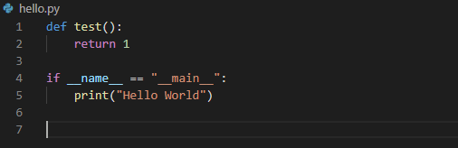

# Assignment 2: Getting started with GitHub and Python
For this assignment, the students will get a feel for the flow of software production, and post to the class repository.  

### Accept the invitation
Each student will have the ability to submit their solutions to the class repository.  Check your email for an invitation from GitHub and accept it by clicking the link.

### Install Microsoft Studio Code
Microsoft studio is a free code editor you can use to edit files outside of processing. 
goto https://code.visualstudio.com/ in order to download and install.

Open code from the git Bash window by typing

        $code .   

### Changing a File
When opening the editor in the class folder you will see all of the files inside the folder on the side panel on the left.

Open _hello.py_ and change the word _World_ in "Hello World" on line 5 to your name and save this file.  _(Do not use save as)_

### Commit and Push to the Repository
Goto the git bash window and type

        $git commit -a -m "first commit"

This commits the changes you made to your file.  You can now submit your code by pushing the changes you made to your branch of the repository.  ***Remember the name of your branch is your first name.***

        $git push origin [branch-name]

One thing to notice here is that when a change is made to a file the changes are tracked instead of creating a new file.  Each of you will change your own version of hello.py from the original.  The repository tracks the changes so that you will have your own versions of everything in the course folder.  This is how work will be submitted for the remainder of this seminar.  I will be checking your submissions on the repository on-line.

