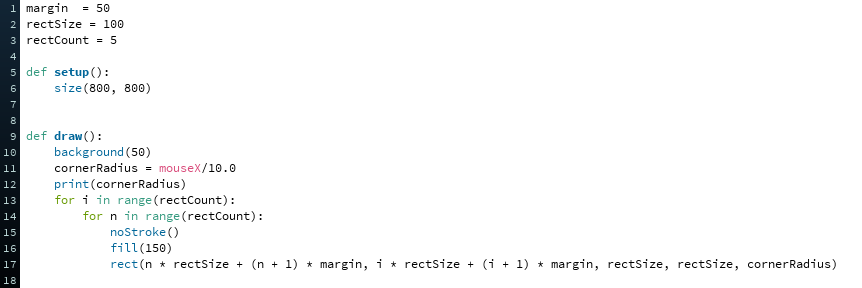
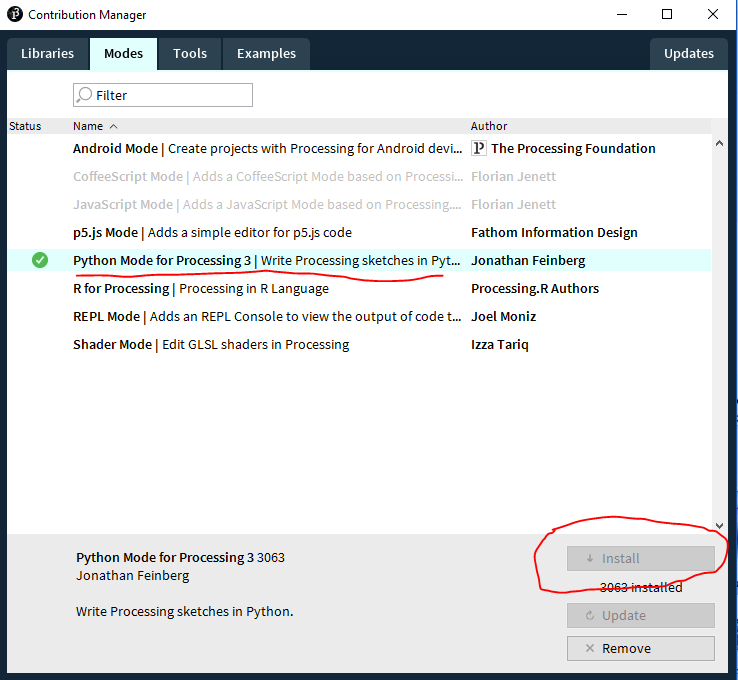

# Assignment 3: Processing Code Snippet
I would like you to run the following code in Processing before Wednesday's class.
Open Processing and enter the following code,  line for line, character for character

Make sure you switch to Python mode.

If you do not have Python mode select
Add Mode->Python Mode for Processing 3...->Install.

Then when you are ready, press the play button on the upper left or ctrl-R to run the code.

A second window should appear with this:

roll your mouse from left to right over this window.  What do you think?

I want you to save this sketch in the "parametric-design-2020" folder on your computer so we can continue with this on Wednesday.  Call the sketch 'roundedRectSnippet'.