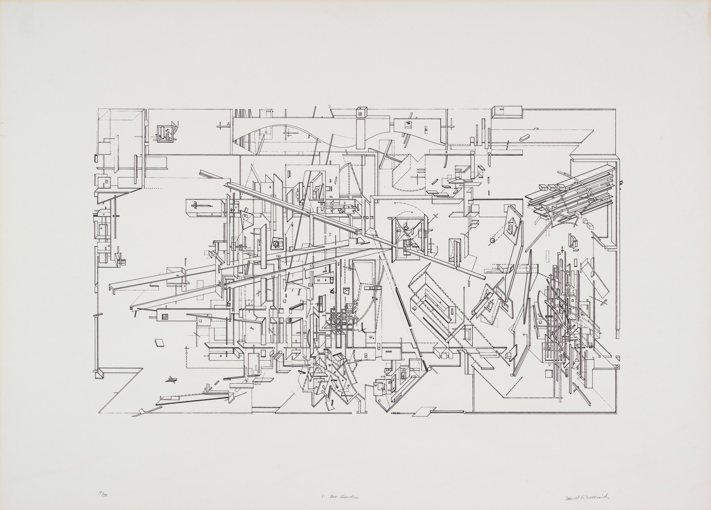

# Assignment 4: Big Plan
*Make big plans; aim high in hope and work, remembering that a noble, logical diagram once recorded will never die.” -Daniel Burnham*

*The Garden,  Daniel Libeskind -1979*

The students will cut a plan for their parametric interventions.  Geometries will be created using processing and concepts will be explored through parametric design methods.  Students will refine the output from these scripted models and produce output in quickly.

## Code Snippets for Plans
We will abstractly use these programs to help with aggregating geometries without getting bogged down with structuring code in a programming language.  The student shall make changes and infer the development of patterns from successive tweaks and modifications of these scripts.

## Class Work Session and Desk Crit
Today we will start our large plans.  This will be one of the deliverables for the final.

For the moment, I don't want you to worry about the strokes or even the fill.  I want to see you experiment with these algorithms, use variables, and get geometry on the pane.

Remeber to set you drawing set your size in the setup function -and have fun.

        def setup():
            size(800,800)